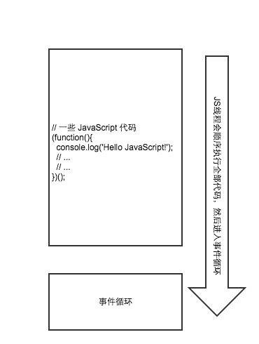
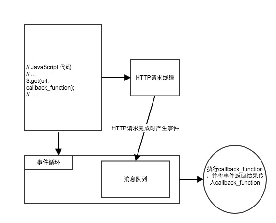
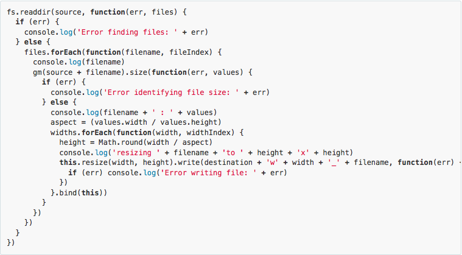

#绪论

##目录：
1.JavaScript简介
2.JavaScript单线程异步
3.JavaScript异步产生的问题，以及现有解决方案

##1 JavaScript的简介

JavaScript是一个轻量级解释型向对象但却将函数视为语言中一级公民的编程语言。JavaScript同时支持基于原型的面向对象编程、命令式编程风格和函数式编程风格，是一种基于原型的、多范式的动态脚本语言。

JavaScript由网景公司雇佣的Brendan Eich实现。它的名字借鉴了当时大行其道的Java并且命名为JavaScript，基本语法借鉴C语言与Java，数据结构借鉴了Java，函数借鉴了Scheme和Awk，将函数视为一等公民，并且引入了闭包概念。原型链的继承模式借鉴了Self语言。正则表达式则借鉴了Perl。一些函数和方法借鉴了Python。但是为了保持简单，语言本身缺少了一些关键功能，比如命名空间、模块等。但是因为语言的动态特性，这些语言都是可以利用现有的功能实现的。所以也造就了学习别的语言通常是学习如何使用语言的功能，而学习JavaScript通常是学习各种解决问题的模式。

JavaScript最常被用在编写网页脚本上，但是随着Google的V8引擎的发布，JavaScript的效率被瞬间提高了降级20倍，并且接近原生代码的执行速度。现在JavaScirpt已经别运用在了各个领域当中，比如用于开发移动智能的应用、桌面计算机上的应用、服务器上的应用、游戏引擎中的脚本，跟甚至跟随这Intel进入了嵌入式应用的领域。比起Java，JavaScript最接近当年Java对世人许下的承诺：“一处编写，到处运行”。

##2 JavaScript的单线程与异步事件驱动

###2.1 JavaScript单线程
JavaScript的单线程是指JavaScript运行时有且只有一个线程在执行JavaScript代码。正因为JavaScript的运行时是单线程的，一旦被阻塞将会阻塞整个JavaScript引擎。所以JavaScript非常多的API被设计成了非阻塞（no-blocked)的模式，例如AJAX等。当JavaScript引擎执行到异步非阻塞的AJAX时并不会阻塞等待AJAX请求的结果，而是继续执行接下来的代码。当AJAX请求返回结果时，会产生一个事件压入JavaScript引擎的消息队列中，最终在事件循环中执行事件的处理的操作。

所以在代码中马上获取异步非阻塞的AJAX是不可能的。（注：虽然大多数浏览器都支持同步的AJAX，但是因为同步的AJAX会因为等待请求返回而使得整个web页面失去响应，所以绝大多数规范中都命令禁止使用同步的AJAX）。

JavaScript线程会逐行执行所有的JavaScript代码后进入事件循环，通过轮询的方式等待以及处理事件。

###2.2 异步事件驱动
正如前面所说，JavaScript的单线程是指JavaScript的运行时有且只有一条线程在执行JavaScript代码。但是我们的浏览器并不是单线程的，也不可能是单线程的。以Webkit为例，一个页面有JavaScript引擎线程、界面渲染线程、浏览器事件触发线程、Http请求线程等线程。浏览器很多行为被设计成了异步的，例如，点击鼠标事件，定时器事件，以及XMLHttpRequest的回调等。当一个产生一个异步事件了以后，它就被会压入一个消息队列。然后由事件循环（Event Loop）中对消息队列进行轮询并进行事件处理事件。

以AJAX为例，当通过AJAX发出了一个请求，浏览器会开一个线程去请求相应的数据，当请求完成了以后会产生一个事件压入消息队列。在事件循环中处理AJAX，执行回调并且将AJAX请求返回的结果作为参数传入回调函数。

##3 JavaScript异步产生的问题，以及现有解决方案

###3.1 回调地狱（Callback Hell）
回调地狱是指在编写JavaScript异步代码时产生的一个导致可维护差的问题。其中一个典型的例子是多重嵌套回调。

这种嵌套的回调函数难以理解，开发人员需要仔细分析哪些代码用于应用的业务逻辑，而哪些代码处理异步函数调用的，代码结构支离破碎。错误处理也分解了，我们需要在各个地方检测错误的发生并作出相应的处理。

###3.2 现有解决方案
由于回调地狱产生的非常多的现有解决方案：

####3.2.1 Promise
Promise最初在E语言中被提出，它是基于并列/并行处理设计的一种编程语言。Promise是一种抽象异步处理对象以及对其进行各种操作的组件。Promise也是一种同步函数与异步函数联系和通讯的方式。可以让异步函数返回值，并且能够抛出异常。

####3.2.2 Async
Async主要解决异步的迭代难题以及异步函数工作次序的的难题，主要在Node.js上，最常见的是做IO操作上。

####3.2.3 Step
Step是极简主义的工作流库。相比Async，Step的实现非常简单，功能也十分单一却十分实用。

