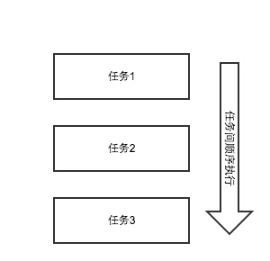
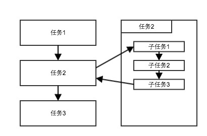
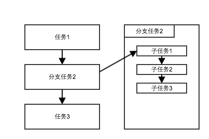
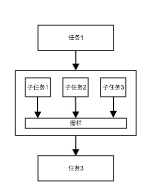

#2 需求分析

<!--
   -系统必须做什么？完整、准确、清晰、具体的要求。
   -
   -功能模型。
   -
   -综合要求：
   -1.功能需求：
   -2.性能需求：
   -3.可靠性和可用性需求：
   -4.约束：
   -5.逆向需求：
   -
   -功能描述
   -运行描述
   -->

上一章已经介绍过JavaScript回调在工程应用产生的问题，同时也介绍了几种解决问题的方案。但是各种各种方案都有其不足的地方，所以我们尝试设计一个更为优秀的解决方案来解决不仅仅是几个异步操作顺序工作流这么简单的问题了，而是更高层次的抽象，将整个JavaScript工程的控制流全部统一抽象出来，通过管道相连接，所有的操作都封装成一个任务。

##1 功能模型

###1.1 任务间顺序执行
任务间严格按照顺序串行执行。

###1.2 子任务
一个任务可以拥有子任务，住任务工作流会等待子任务全部按顺序执行完成后才继续执行主工作流。

###1.3 分支任务
分支类似于子任务，但是主任务工作流并不会等待分支任务执行完成，而是开启新的分支任务后立即执行下一个任务。

###1.3 栅栏
等待当多个任务都执行完成后（无顺序先后），才继续执行下一个任务。

